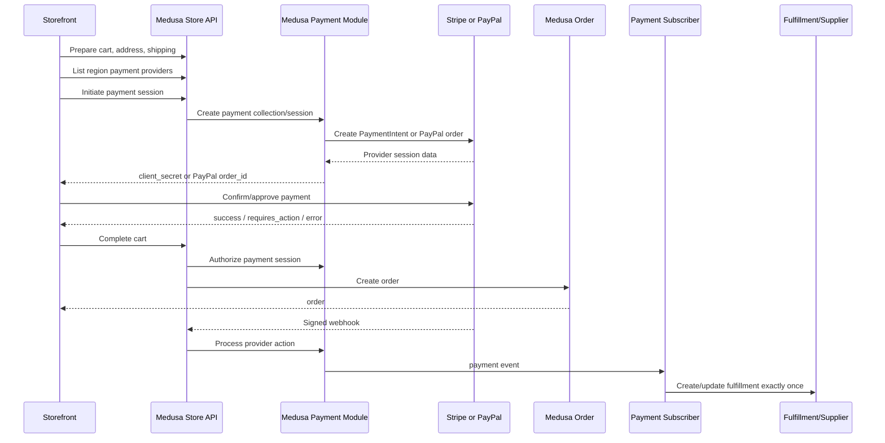

# Ciiverse Payment Closure Skill

## 1. Mission

You are working in the `ai-commerce-platform` repository.

Your task is not merely to display Stripe or PayPal buttons. Your task is to complete and verify the entire transaction state machine:

```text
cart
→ contact/address
→ shipping method
→ payment provider selection
→ payment collection
→ payment session
→ customer authorization / capture
→ complete cart
→ Medusa order
→ payment state synchronization
→ fulfillment order
→ supplier push
→ buyer/seller order visibility
→ refund and failure recovery
```

The implementation is complete only when this flow is reproducible in test or sandbox mode, protected against duplicate requests, and observable through logs and tests.

Do not claim that payment is complete because a UI component renders, a provider SDK loads, or unit tests pass.

---

## 2. Repository Context

### 2.1 Stack

The repository is an npm-workspaces monorepo.

Key applications:

```text
apps/medusa-backend      Medusa v2 backend
apps/storefront          Buyer storefront, React + Vite
apps/seller-dashboard    Seller application
apps/platform-ops        Platform operations
apps/ai-worker           Python service
packages/shared-types    Shared contracts
```

Relevant installed versions in the audited branch include:

```text
Node.js                 >= 20
@medusajs/medusa        2.14.x
@medusajs/framework     2.14.x
@medusajs/payment-stripe 2.14.x
React                   18.x
Vite                    5.x
@stripe/react-stripe-js 6.x
@stripe/stripe-js       9.x
```

Important rule:

> The installed TypeScript interfaces and package versions are the implementation source of truth. Current online documentation may describe a newer Medusa version. Use official documentation for architecture, then compile against the installed version and adapt method signatures without upgrading unrelated packages.

### 2.2 Known Stripe Files

Inspect these first:

```text
apps/medusa-backend/medusa-config.ts
apps/medusa-backend/src/lib/stripe-client.ts
apps/medusa-backend/src/lib/stripe-region-setup.ts
apps/medusa-backend/src/scripts/enable-stripe-region.ts
apps/medusa-backend/src/scripts/pay-stripe-e2e-setup.ts
apps/medusa-backend/src/scripts/pay-stripe-http-smoke.mjs
apps/medusa-backend/src/scripts/pay-stripe-live-e2e.mjs
apps/medusa-backend/src/api/store/carts/[id]/complete/route.ts
apps/medusa-backend/src/api/webhooks/stripe/route.ts
apps/medusa-backend/src/lib/webhook-dedupe.ts
apps/medusa-backend/src/subscribers/payment-captured-sync.ts
apps/medusa-backend/src/lib/sync-order-paid-fulfillment.ts
apps/medusa-backend/src/lib/customer-payment-methods.ts
apps/medusa-backend/src/lib/seller-stripe-connect.ts

apps/storefront/src/pages/checkout/CheckoutPage.tsx
apps/storefront/src/pages/checkout/checkout-payment.ts
apps/storefront/src/components/checkout/CheckoutPaymentPanel.tsx
apps/storefront/src/components/checkout/CheckoutSuccessSummary.tsx
apps/storefront/src/lib/buyer-api.ts
apps/storefront/src/pages/account/AccountPaymentMethods.tsx
apps/storefront/src/components/account/StripeSetupForm.tsx

docs/pay-stripe-01.md
```

The existing backend already conditionally registers the official Medusa Stripe provider and uses provider ID:

```text
pp_stripe_stripe
```

The repository also includes scripts intended to:

```text
enable Stripe on regions
create isolated Stripe E2E fixtures
perform HTTP smoke tests
perform a test-mode live E2E flow
```

Do not delete this scaffolding before understanding it.

### 2.3 Known PayPal Work

PayPal work may exist only in the current worktree and may not be committed.

Inspect:

```text
apps/medusa-backend/src/modules/paypal/
docs/PAYPAL_SETUP.md
apps/medusa-backend/medusa-config.ts
apps/storefront/src/pages/checkout/CheckoutPage.tsx
apps/storefront/src/components/checkout/CheckoutPaymentPanel.tsx
apps/storefront/src/lib/buyer-api.ts
apps/storefront/package.json
apps/medusa-backend/package.json
```

Do not assume the PayPal code is present on the current branch merely because an old audit mentioned it.

### 2.4 Stripe Connect Is a Separate Domain

Seller Stripe Connect onboarding or payout logic is not the buyer checkout payment provider.

Keep these concerns separate:

```text
Buyer checkout:
Medusa payment session → Stripe PaymentIntent → order payment

Seller payout/onboarding:
Stripe Connect account → payout readiness / future marketplace settlement
```

Do not silently convert checkout into Stripe destination charges, separate charges and transfers, or application-fee flows. Marketplace fund flow requires a separate approved architecture and compliance decision.

---

## 3. Non-Negotiable Engineering Rules

### 3.1 One Payment Source of Truth

Medusa Payment Module is the canonical payment state machine.

For Stripe:

```text
Medusa payment collection
→ Medusa Stripe payment session
→ Stripe PaymentIntent
→ Medusa complete-cart flow
→ Medusa payment/order events
```

For PayPal:

```text
Medusa payment collection
→ custom Medusa PayPal provider
→ PayPal Orders v2 order
→ approval/authorization/capture
→ Medusa complete-cart flow
→ Medusa payment/order events
```

Do not build a parallel table or custom route that independently decides that a cart is paid.

### 3.2 Never Trust the Browser for Amount or Paid State

The browser may send:

```text
cart ID
provider selection
provider approval result
```

The browser must not be trusted to send:

```text
authoritative amount
authoritative currency
"paid": true
seller payout amount
platform fee
fulfillment-ready status
```

Amounts and currency must be derived from the server-side cart, region, payment collection, and provider session.

### 3.3 Do Not Mix Two Stripe Architectures

This project already uses Medusa Stripe Payment Provider and Stripe Payment Element / PaymentIntent.

Do not copy a Stripe Checkout Session sample into the same order flow unless the architecture is explicitly changed.

The default choice for this repository is:

```text
Medusa payment session + Stripe PaymentIntent + Stripe Elements
```

### 3.4 No Live Charges During Development

Default to:

```text
Stripe test mode
PayPal sandbox
S2BDIY mock or sandbox
```

Refuse to run payment E2E when:

```text
STRIPE_API_KEY starts with sk_live_
VITE_STRIPE_PK starts with pk_live_
PAYPAL_ENVIRONMENT is production
```

unless the user explicitly authorizes a production verification plan and provides a safe, reversible procedure.

Never print full secrets.

### 3.5 Preserve Existing Worktree State

Before any edit:

```bash
pwd
git branch --show-current
git rev-parse HEAD
git status -sb
git diff --stat
git diff -- apps/medusa-backend apps/storefront
git ls-files --others --exclude-standard
```

If payment files are modified or untracked, classify them before editing.

Do not use:

```text
git reset --hard
git clean -fd
git checkout -- .
git restore .
force push
```

Do not overwrite uncommitted PayPal work.

### 3.6 Test-Mode Evidence Is Required

Static code inspection is not enough.

At least one successful Stripe test transaction and one PayPal sandbox transaction must produce evidence for:

```text
payment provider available
payment session initialized
provider payment approved
cart completed
order ID returned
buyer can see order
seller can see order
payment status is correct
fulfillment order exists in expected state
duplicate event does not duplicate fulfillment or supplier order
```

---

## 4. Definition of Done

Payment closure is complete only when all required gates pass.

### Gate A: Build and Configuration

```text
backend TypeScript/build passes
storefront typecheck/build passes
database migrations pass
Redis/PostgreSQL are reachable
publishable API key is valid
test/sandbox payment credentials are configured
provider is registered
provider is enabled for the active region
```

### Gate B: Checkout Preconditions

```text
cart has at least one valid native Medusa variant
cart total is greater than zero
customer/contact email is present
shipping address is valid when shipping is required
shipping method is selected when shipping is required
cart currency matches region/provider support
payment collection exists
selected provider has a payment session
```

### Gate C: Provider Flow

Stripe:

```text
payment session returns client_secret
Stripe Elements renders
confirmPayment handles success, error, and required action
no secret key reaches the browser
```

PayPal:

```text
payment session returns PayPal order ID
PayPal JS SDK renders only when client ID is valid
buyer approval is captured or authorized according to configured policy
cancel/error callbacks preserve the cart
no client secret reaches the browser
```

### Gate D: Order Completion

```text
complete-cart is called exactly once logically
response is an order, not a cart error
local cart state is cleared only after order success
success page reads a real order identifier
retrying the browser action does not create another charge
```

### Gate E: Asynchronous Consistency

```text
provider webhook signature is verified
duplicate webhook delivery is idempotent
Medusa payment state becomes authorized/captured as expected
payment.captured or equivalent internal event is processed
fulfillment order is created once
supplier push is created once or safely retryable
email/notification failure does not roll back payment
```

### Gate F: Refund

```text
refund is invoked through the payment provider
refund amount is validated server-side
partial/full refund states are recorded
duplicate refund requests cannot refund twice
buyer and seller see consistent refund state
```

---

## 5. Target Architecture



### 5.1 Canonical Provider Endpoints

For Medusa Payment Module provider webhooks, prefer the official route shape:

```text
/hooks/payment/{provider_id_without_pp_prefix}
```

Expected examples:

```text
Stripe: /hooks/payment/stripe_stripe
PayPal: /hooks/payment/paypal_paypal
```

If the repository also has:

```text
/apps/medusa-backend/src/api/webhooks/stripe/route.ts
```

do not assume both endpoints are needed.

Audit whether the custom route:

```text
duplicates the official Medusa webhook
exists for historical reasons
handles Stripe Connect rather than checkout
delegates correctly to Payment Module
causes duplicate payment events
```

Select one canonical checkout webhook path and document it. Do not leave Stripe Dashboard configured to deliver the same event to two endpoints that both mutate state.

---

## 6. Required First Pass: Read-Only Audit

Before writing code, create `docs/payment-closure-audit.md`.

The audit must include:

### 6.1 Git State

```text
current directory
current branch
HEAD SHA
remote tracking branch
modified payment files
untracked payment files
whether PayPal code is committed
```

### 6.2 Dependency State

Report exact installed versions for:

```text
@medusajs/framework
@medusajs/medusa
@medusajs/payment-stripe
@stripe/stripe-js
@stripe/react-stripe-js
@paypal/paypal-server-sdk
@paypal/react-paypal-js or chosen frontend SDK
```

Do not install dependencies during the audit.

### 6.3 Route and Call Graph

Trace these functions and endpoints:

```text
provider list
payment collection creation
payment session initialization
Stripe confirm
PayPal approve/capture
cart complete
order creation
payment webhook
payment.captured subscriber
fulfillment creation
supplier push
refund
```

For every stage, record:

```text
frontend caller
API path
backend route/workflow
Medusa module/provider
stored IDs
emitted event
failure behavior
retry behavior
```

### 6.4 Environment Presence Without Secret Exposure

Print only booleans and prefixes:

```bash
node - <<'NODE'
const names = [
  "DATABASE_URL",
  "REDIS_URL",
  "STRIPE_API_KEY",
  "STRIPE_WEBHOOK_SECRET",
  "PAYPAL_CLIENT_ID",
  "PAYPAL_CLIENT_SECRET",
  "PAYPAL_WEBHOOK_ID",
  "PAYPAL_ENVIRONMENT",
]
for (const name of names) {
  const value = process.env[name] || ""
  const prefix = value ? value.slice(0, 8) : ""
  console.log(`${name}: present=${Boolean(value)} prefix=${prefix}`)
}
NODE
```

Never output complete values.

### 6.5 Current Status Classification

Use only these labels:

```text
DONE_STATIC
PARTIAL_STATIC
RUNTIME_UNVERIFIED
BLOCKED_ENV
BLOCKED_DB
BROKEN
MISSING
WORKTREE_ONLY
```

Do not label payment `DONE` without runtime evidence.

---

## 7. Implementation Order

Follow this order. Do not implement Stripe and PayPal simultaneously before the shared checkout contract is stable.

### Phase 0: Stabilize Baseline

1. Confirm the intended base branch.
2. Preserve or commit current PayPal work separately.
3. Make backend build/typecheck pass.
4. Make storefront typecheck/build pass.
5. Start PostgreSQL and Redis.
6. Run migrations.
7. Verify a valid Medusa publishable API key.
8. Verify cart/product/shipping without payment.

Stop if the cart cannot be completed with the system provider. Payment provider debugging is not useful until the base cart/order flow works.

### Phase 1: Close Stripe in Test Mode

1. Confirm official provider registration.
2. Enable `pp_stripe_stripe` on the active region.
3. Verify provider listing.
4. Initialize a payment session.
5. Verify returned `client_secret`.
6. Confirm with Stripe Elements or scripted test PaymentMethod.
7. Complete the cart.
8. Verify order visibility.
9. Verify webhook processing.
10. Verify one fulfillment record.
11. Verify duplicate webhook behavior.
12. Verify failed card and 3DS flows.

### Phase 2: Implement PayPal Provider

Only after Stripe and shared cart completion are stable:

1. Implement or repair custom PayPal Payment Module Provider.
2. Register provider conditionally.
3. Enable provider on region.
4. Add PayPal storefront UI.
5. Add sandbox webhook.
6. Add E2E fixture and smoke scripts.
7. Verify order, payment, and fulfillment behavior matches Stripe.

### Phase 3: Shared Recovery and Observability

1. Add payment attempt correlation IDs.
2. Add idempotency.
3. Add recovery for "provider paid, complete-cart failed".
4. Add structured logs.
5. Add buyer-facing retry messages.
6. Add admin diagnostic endpoint or script.
7. Document webhook setup.

### Phase 4: Refund and Saved Methods

Implement only after checkout is stable:

```text
Stripe saved cards through SetupIntent
Stripe refund
PayPal refund
default payment method
remove payment method
refund status synchronization
```

Do not block checkout closure on saved-card UI.

---

## 8. Stripe Implementation Contract

### 8.1 Backend Configuration

Keep the official Medusa Stripe provider registered in `medusa-config.ts`.

The provider should be conditionally registered only when a valid secret key is present.

Conceptual configuration:

```ts
{
  resolve: "@medusajs/payment-stripe",
  id: "stripe",
  options: {
    apiKey: process.env.STRIPE_API_KEY,
    webhookSecret: process.env.STRIPE_WEBHOOK_SECRET,
    capture: true,
    automaticPaymentMethods: true,
  },
}
```

Do not copy this blindly. Confirm the exact option names in the installed package.

For the current MVP, use a clear capture policy.

Recommended default:

```text
Stripe capture = true
PayPal autoCapture = true
```

This gives both providers the same user-visible semantics.

If the business requires authorize-now/capture-later, change both provider policy and fulfillment trigger together. Do not authorize in one provider and auto-capture in the other without documenting the difference.

### 8.2 Region Enablement

Provider registration is not enough.

Confirm:

```text
payment module lists pp_stripe_stripe
active region includes pp_stripe_stripe
cart uses that region
storefront lists provider for that region
```

Retain or repair:

```bash
npm --workspace apps/medusa-backend run stripe:region:setup
```

The script must:

```text
fail when Stripe is not configured
fail when provider is not registered
preserve existing region providers
add Stripe idempotently
print only region IDs, never secrets
```

### 8.3 Payment Session Creation

Use the Medusa payment flow:

```text
create payment collection for cart
initialize payment session for pp_stripe_stripe
read payment session data.client_secret
```

Do not call Stripe `paymentIntents.create` separately from the storefront or a custom cart route.

If custom wrapper routes remain, they must delegate to Medusa workflows/modules and return Medusa-shaped data.

### 8.4 Storefront Stripe Flow

Expected flow:

```ts
async function placeStripeOrder() {
  // 1. Validate cart/contact/address/shipping.
  // 2. Ensure Stripe payment session exists.
  // 3. Read client_secret from the active Medusa payment session.
  // 4. Submit Stripe Payment Element.
  // 5. Call stripe.confirmPayment.
  // 6. Handle redirect/requires_action.
  // 7. Only after successful provider confirmation, complete the Medusa cart.
  // 8. Redirect using the returned Medusa order ID.
}
```

Required safeguards:

```text
disable button while submitting
one in-flight request per cart
do not clear cart before order response
do not expose secret key
do not accept a fake client_secret
do not render a fake card form when session is missing
show explicit provider/configuration errors
```

### 8.5 PaymentIntent Status Handling

Handle at least:

```text
succeeded
processing
requires_capture
requires_action
requires_payment_method
canceled
```

For synchronous card success, complete cart after confirmation.

For asynchronous methods, use the status semantics supported by the installed Medusa provider. Do not mark the order paid merely because the browser returned from a redirect.

### 8.6 Stripe Webhook

Use the canonical Medusa provider hook unless a documented reason requires a custom endpoint.

Production/test setup should include the Medusa-supported events for the installed provider. At minimum, verify support for:

```text
payment_intent.succeeded
payment_intent.payment_failed
payment_intent.amount_capturable_updated
```

Webhook requirements:

```text
raw request body available for signature validation
endpoint-specific webhook secret
test and live webhook secrets separated
2xx returned after successful processing
event ID used for dedupe
duplicate delivery produces no duplicate fulfillment
```

### 8.7 Direct Stripe Client Usage

The repository contains `stripe-client.ts` and direct Stripe API helpers.

Audit every caller.

Allowed uses may include:

```text
Stripe Connect onboarding
saved payment method setup/list/delete
diagnostics
test-only E2E scripts
payment method label lookup
```

Disallowed production use:

```text
creating a second PaymentIntent for the same cart
confirming buyer card server-side with a live secret
marking an order paid outside Medusa Payment Module
using direct API response as the only order source of truth
```

Any direct Stripe POST must use an idempotency key based on a stable business operation:

```text
cart:{cartId}:payment-session
order:{orderId}:capture
refund:{refundRequestId}
connect:{storeId}:account
```

### 8.8 Stripe Test Cases

Browser or integration cases:

| Case | Expected result |
|---|---|
| Normal success | Order returned; captured/authorized status correct |
| 3DS required | Authentication shown; order after success |
| Card declined | Cart remains; no order; retry possible |
| Double click | One logical charge/order |
| Network failure after confirmation | Recovery finds existing PaymentIntent/session |
| Complete-cart 500 after successful payment | Retry completes same cart without a second charge |
| Duplicate webhook | One payment effect and one fulfillment |
| Invalid webhook signature | 4xx and no mutation |
| Zero-total cart | Do not initialize Stripe session; use system provider or block |
| Cart amount changed after session | Refresh/update payment collection/session before completion |

---

## 9. PayPal Implementation Contract

### 9.1 Use a Medusa Payment Module Provider

Implement a custom provider under:

```text
apps/medusa-backend/src/modules/paypal/index.ts
apps/medusa-backend/src/modules/paypal/service.ts
apps/medusa-backend/src/modules/paypal/types.ts
```

The service must extend the installed Medusa `AbstractPaymentProvider`.

Use the official PayPal server SDK or direct REST client only on the backend.

Expected provider ID:

```text
pp_paypal_paypal
```

Expected Medusa webhook path:

```text
/hooks/payment/paypal_paypal
```

### 9.2 Required Provider Methods

Use local TypeScript definitions to determine exact signatures.

The provider normally needs behavior equivalent to:

```text
initiatePayment
authorizePayment
capturePayment
refundPayment
updatePayment
deletePayment
retrievePayment
cancelPayment
getPaymentStatus
getWebhookActionAndData
```

Do not leave methods throwing "not implemented" if Medusa can call them during normal checkout, admin capture, refund, provider switch, or webhook handling.

### 9.3 PayPal Data Mapping

Store stable PayPal identifiers in payment session/payment data:

```ts
type PayPalPaymentData = {
  order_id?: string
  authorization_id?: string
  capture_id?: string
  refund_id?: string
  intent?: "CAPTURE" | "AUTHORIZE"
  currency_code?: string
  medusa_session_id?: string
}
```

Do not store access tokens.

### 9.4 Initiate Payment

`initiatePayment` must:

```text
take amount/currency from Medusa input
convert amount safely to PayPal decimal representation
create one PayPal Orders v2 order
set intent from autoCapture policy
set a stable custom/reference ID that maps to the Medusa payment session
return order_id in payment session data
use PayPal-Request-Id for idempotency
```

Never take amount from the browser.

### 9.5 Authorize or Capture

On buyer approval:

```text
CAPTURE policy:
capture the PayPal order and return capture_id + authorized status

AUTHORIZE policy:
authorize the PayPal order and return authorization_id + authorized status
```

Do not capture both in the storefront and again in the provider method.

Choose one ownership model:

Recommended:

```text
Storefront PayPal Buttons obtains buyer approval.
Backend provider performs the authoritative capture/authorization.
Medusa complete-cart authorizes the payment session.
```

If the PayPal JS SDK callback calls a custom backend capture route, that route must be the same operation used by the provider and must be idempotent. Avoid two different capture implementations.

### 9.6 Update and Delete

When cart amount changes:

```text
update PayPal order amount before approval
or invalidate/recreate payment session
```

PayPal orders that cannot be deleted may be allowed to expire. `deletePayment` should safely return data if the installed Medusa interface expects it.

### 9.7 Cancel

If payment is authorized but not captured, void the authorization.

If only a pre-approval PayPal order exists, document that it expires and does not require a mutation.

### 9.8 Refund

Refund must:

```text
use capture_id
validate amount <= refundable amount
use original currency
use PayPal-Request-Id
record refund_id
be safe on retry
```

### 9.9 PayPal Webhook Verification

Verify every event.

Use:

```text
PayPal transmission headers
configured PAYPAL_WEBHOOK_ID
raw body when required
PayPal signature verification API or valid local cryptographic verification
```

Map relevant events to Medusa payment actions.

At minimum consider:

```text
PAYMENT.AUTHORIZATION.CREATED
PAYMENT.AUTHORIZATION.VOIDED
PAYMENT.CAPTURE.COMPLETED
PAYMENT.CAPTURE.DENIED
PAYMENT.CAPTURE.REFUNDED
CHECKOUT.ORDER.APPROVED
```

Only map events supported by the installed Medusa action enum.

Unrecognized events should return `not_supported`, not mutate payment state.

### 9.10 PayPal Storefront

Add the PayPal frontend SDK only when needed.

Suggested package:

```text
@paypal/react-paypal-js
```

Confirm compatibility before installing.

Expected UI flow:

```tsx
<PayPalScriptProvider options={{ clientId, currency }}>
  <PayPalButtons
    createOrder={() => paymentSession.data.order_id}
    onApprove={handleApprove}
    onCancel={handleCancel}
    onError={handleError}
    disabled={!checkoutReady}
  />
</PayPalScriptProvider>
```

Do not place `PAYPAL_CLIENT_SECRET` in Vite environment variables.

Allowed browser variable:

```text
VITE_PAYPAL_CLIENT_ID
```

Required UI states:

```text
SDK loading
provider unavailable
invalid client ID
payment session missing
buyer canceled
approval failed
capture failed
complete-cart failed after approval
order success
```

### 9.11 PayPal Sandbox Test Cases

| Case | Expected result |
|---|---|
| Sandbox buyer success | One order, correct payment state |
| Buyer cancels popup | Cart retained; no order |
| Invalid sandbox login/funding failure | Recoverable error |
| Double approval callback | One capture/order |
| Capture succeeds, complete-cart fails | Recovery without second capture |
| Duplicate webhook | One payment effect |
| Invalid webhook signature | No mutation |
| Refund | PayPal refund and Medusa refund state agree |
| Provider switch PayPal → Stripe | Old PayPal session safely abandoned |
| Amount changed | PayPal order updated/recreated |

---

## 10. Shared Complete-Cart Contract

The custom route:

```text
apps/medusa-backend/src/api/store/carts/[id]/complete/route.ts
```

must not become an independent payment engine.

Its responsibilities should be limited to:

```text
authenticate/authorize the buyer context
load authoritative cart
validate cart is checkout-ready
verify selected Medusa payment session exists
invoke Medusa complete-cart workflow/API
return normalized order/cart error
attach only safe marketplace metadata
trigger no duplicate provider charge
```

Do not mutate line items, shipping methods, discounts, or totals inside a late complete-cart validation hook after payment amount was calculated.

If cart data changes, update the cart first, then refresh/recreate the payment session.

### 10.1 Response Contract

Use one normalized result:

```ts
type CompleteCartResult =
  | {
      type: "order"
      order: {
        id: string
        display_id?: number
        payment_status?: string
        fulfillment_status?: string
      }
    }
  | {
      type: "cart"
      cart: unknown
      error: {
        code: string
        message: string
        retryable: boolean
      }
    }
```

Do not return only `success: true`.

### 10.2 Recovery: Paid but Order Not Completed

This is a mandatory case.

Scenario:

```text
provider confirms/captures successfully
network or backend fails before complete-cart returns
buyer clicks again
```

Required behavior:

1. Re-read Medusa payment session.
2. Reuse the same provider object/session.
3. Check whether the cart already produced an order.
4. Retry complete-cart idempotently.
5. Never create a second PaymentIntent or PayPal order.
6. Show a recoverable "payment received, finalizing order" state.
7. Provide a diagnostic correlation ID.

Add a helper or endpoint that resolves:

```text
cart ID → payment session → provider ID → provider transaction ID → order ID
```

without exposing secrets.

---

## 11. Payment, Order, and Fulfillment State Boundaries

Keep these states distinct.

### Payment

```text
pending
requires_action
authorized
captured
failed
canceled
refunded
partially_refunded
```

### Order

```text
created
pending
completed
canceled
```

### Fulfillment

```text
waiting
pushed
in_production
shipped
delivered
failed
```

Payment success does not mean supplier fulfillment succeeded.

Supplier failure must not refund automatically unless a documented compensation policy exists.

Recommended flow:

```text
payment captured
→ create fulfillment order exactly once
→ attempt supplier push
→ on supplier failure, keep paid order and mark fulfillment failed/retryable
→ notify operations
```

### 11.1 Idempotent Fulfillment

Use a unique business key, such as:

```text
order_id + store_id + supplier_id
```

Enforce uniqueness in code and preferably the database.

A duplicate `payment.captured` event must not create another:

```text
fulfillment order
supplier order
email
seller notification
```

For side effects that may be retried, record separate effect status.

---

## 12. Security Requirements

### 12.1 Secret Handling

Never commit or print:

```text
STRIPE_API_KEY
STRIPE_WEBHOOK_SECRET
PAYPAL_CLIENT_SECRET
PAYPAL_WEBHOOK_ID if treated as sensitive operational data
PayPal access tokens
buyer payment method details
full webhook payloads containing personal data
```

Frontend may receive only:

```text
Stripe publishable key
Stripe client_secret for that PaymentIntent
PayPal client ID
PayPal order ID
safe payment labels/status
```

### 12.2 Key Mode Matching

Block mixed modes:

```text
sk_test_ with pk_live_
sk_live_ with pk_test_
PayPal sandbox client ID with production API base
test webhook secret used for live endpoint
```

Add a startup or diagnostic check that reports mode mismatch without printing keys.

### 12.3 Webhook Security

```text
verify signature before mutation
use raw body where required
limit body size
rate limit public custom webhook routes if applicable
dedupe by provider event ID
log event ID and type, not full card/customer data
return 2xx only after durable acceptance
```

### 12.4 Browser Security

```text
never use dangerouslySetInnerHTML for provider errors
do not put client_secret in localStorage
do not put secrets in query logs
clear provider errors on safe retry
prevent repeated submit
```

### 12.5 PCI Scope

Use provider-hosted fields/components:

```text
Stripe Payment Element
PayPal Buttons / PayPal hosted experience
```

Do not build raw credit-card inputs that post card numbers to this backend.

---

## 13. Environment Contract

### Backend `.env`

```dotenv
DATABASE_URL=postgres://...
REDIS_URL=redis://...

STRIPE_API_KEY=sk_test_...
STRIPE_WEBHOOK_SECRET=whsec_...

PAYPAL_CLIENT_ID=...
PAYPAL_CLIENT_SECRET=...
PAYPAL_ENVIRONMENT=sandbox
PAYPAL_WEBHOOK_ID=...
PAYPAL_AUTO_CAPTURE=true
```

### Storefront `.env.local`

```dotenv
VITE_MEDUSA_BASE_URL=http://127.0.0.1:9000
VITE_PUBLISHABLE_API_KEY=pk_...        # Medusa publishable API key
VITE_STRIPE_PK=pk_test_...             # Stripe publishable key
VITE_PAYPAL_CLIENT_ID=...              # PayPal public client ID
VITE_DEFAULT_STORE_ID=...
```

Do not confuse:

```text
VITE_PUBLISHABLE_API_KEY = Medusa publishable API key
VITE_STRIPE_PK            = Stripe publishable API key
```

They are different keys.

### Local Webhooks

Stripe:

```bash
stripe listen --forward-to http://127.0.0.1:9000/hooks/payment/stripe_stripe
```

Use the webhook signing secret printed by the Stripe CLI for this local listener.

PayPal:

```text
Use a public HTTPS tunnel.
Register:
https://<tunnel>/hooks/payment/paypal_paypal
```

Store the corresponding PayPal Webhook ID.

---

## 14. Commands and Verification

### 14.1 Install

Do not upgrade all dependencies.

After reviewing package changes:

```bash
npm install
```

For PayPal, install only the required packages in the correct workspace:

```bash
npm --workspace apps/medusa-backend install @paypal/paypal-server-sdk
npm --workspace apps/storefront install @paypal/react-paypal-js
```

Pin versions intentionally. Record why each dependency is needed.

### 14.2 Infrastructure

Inspect repository compose files first.

Typical sequence:

```bash
docker compose -f infra/docker-compose.yml up -d postgres redis
```

Verify:

```bash
docker compose -f infra/docker-compose.yml ps
```

### 14.3 Migrations

From repository root:

```bash
npm run db:migrate
```

Or:

```bash
npm --workspace apps/medusa-backend run db:migrate
```

Do not run migrations against an unknown database.

### 14.4 Build and Test

```bash
npm --workspace apps/medusa-backend run build
npm --workspace apps/storefront run typecheck
npm --workspace apps/storefront run build
npm --workspace apps/medusa-backend run test -- --runInBand
npm --workspace apps/storefront run test -- --runInBand
```

Run focused tests first when the full suite is slow.

### 14.5 Stripe Setup

```bash
npm --workspace apps/medusa-backend run stripe:region:setup
```

Isolated test fixture:

```bash
PAY_STRIPE_E2E_SETUP=true \
npm --workspace apps/medusa-backend run pay-stripe:e2e:setup
```

Smoke:

```bash
npm --workspace apps/medusa-backend run pay-stripe:http-smoke
```

Scripted provider E2E must reject live keys:

```bash
npm --workspace apps/medusa-backend run pay-stripe:live-e2e
```

Despite the historical script name, it must run only with `sk_test_`.

### 14.6 Add PayPal Scripts

Add equivalent scripts:

```json
{
  "paypal:region:setup": "medusa exec ./src/scripts/enable-paypal-region.ts",
  "pay-paypal:e2e:setup": "medusa exec ./src/scripts/pay-paypal-e2e-setup.ts",
  "pay-paypal:http-smoke": "node ./src/scripts/pay-paypal-http-smoke.mjs"
}
```

The HTTP smoke should stop before interactive approval if automation is not available, then print the exact sandbox steps required.

### 14.7 Provider Diagnostic Script

Create:

```text
apps/medusa-backend/src/scripts/payment-provider-diagnostics.ts
```

It should report:

```text
Stripe configured: true/false
PayPal configured: true/false
registered provider IDs
region IDs and enabled payment provider IDs
test/live/sandbox mode
webhook secret configured: true/false
active database host/port/database name, with password removed
Redis reachable
```

Never print full secrets or access tokens.

---

## 15. Required Tests

### 15.1 Backend Unit Tests

Add or preserve tests for:

```text
provider registration with/without env
region setup idempotency
complete-cart rejects missing Stripe session/client_secret
complete-cart rejects missing PayPal order ID
cart readiness validation
amount/currency mismatch
webhook invalid signature
webhook duplicate event
payment captured creates one fulfillment
supplier push retry does not duplicate supplier order
refund amount validation
```

### 15.2 Frontend Tests

Test:

```text
default provider selection
Stripe chosen only with valid pk and provider availability
PayPal chosen only with valid client ID and provider availability
Stripe form hidden without client_secret
PayPal button hidden without order_id
button disabled while submitting
provider error rendered safely
cart cleared only after order result
cancel preserves cart
recovery UI for paid/finalizing order
```

### 15.3 Integration Tests

Create a provider-neutral test harness that takes:

```ts
type PaymentE2EAdapter = {
  providerId: string
  initialize(cartId: string): Promise<ProviderSession>
  approve(session: ProviderSession): Promise<ProviderApproval>
  complete(cartId: string): Promise<OrderResult>
  inspect(transactionId: string): Promise<ProviderStatus>
}
```

Use separate adapters for Stripe and PayPal.

The shared assertions must be identical.

### 15.4 Evidence File

Every E2E run must write a redacted JSON report:

```json
{
  "provider": "stripe",
  "mode": "test",
  "cart_id": "cart_...",
  "payment_session_id": "payses_...",
  "provider_transaction_id": "pi_...",
  "order_id": "order_...",
  "buyer_order_visible": true,
  "seller_order_visible": true,
  "payment_status": "captured",
  "fulfillment_status": "waiting",
  "duplicate_webhook_test": "passed",
  "timestamp": "ISO-8601"
}
```

Do not include:

```text
client_secret
secret key
webhook secret
PayPal access token
full address
full email unless it is an isolated test fixture
```

---

## 16. Failure Matrix

| Failure | Required behavior |
|---|---|
| Database unavailable | Stop before provider calls; clear diagnostic |
| Redis unavailable | Follow project policy; do not silently lose idempotency/jobs |
| Provider not registered | Backend startup/diagnostic identifies missing env |
| Provider not enabled on region | Setup script or admin action fixes region |
| Invalid publishable key | UI blocks payment and explains exact variable |
| Payment session missing | Reinitialize session, do not fake form |
| Stripe confirm declined | Preserve cart; no order |
| PayPal buyer cancel | Preserve cart; no order |
| Provider paid, complete failed | Recover same provider transaction; no second charge |
| Complete succeeded, response lost | Find order by cart/payment and show success |
| Webhook delayed | Order may show pending; polling/reconciliation updates |
| Duplicate webhook | No duplicate fulfillment or email |
| Supplier push failed | Paid order remains; fulfillment marked retryable |
| Refund provider failed | Refund request remains failed/pending; no fake success |
| Email failed | Payment/order remain successful; retry notification separately |

---

## 17. Observability

Use structured log fields:

```text
operation
correlation_id
cart_id
payment_collection_id
payment_session_id
provider_id
provider_transaction_id
order_id
store_id
event_id
attempt
status
error_code
```

Never log secret values.

Suggested operation names:

```text
payment.provider.list
payment.session.initialize
payment.stripe.confirm
payment.paypal.approve
payment.cart.complete
payment.webhook.receive
payment.webhook.dedupe
payment.fulfillment.create
payment.supplier.push
payment.refund
```

Add a correlation ID at the beginning of the checkout attempt and propagate it through frontend request headers and backend logs.

---

## 18. Files and Ownership

Prefer small modules rather than expanding `buyer-api.ts` and `CheckoutPage.tsx`.

Suggested split:

```text
apps/storefront/src/lib/payments/payment-api.ts
apps/storefront/src/lib/payments/payment-types.ts
apps/storefront/src/lib/payments/payment-recovery.ts
apps/storefront/src/components/checkout/StripePaymentForm.tsx
apps/storefront/src/components/checkout/PayPalPaymentButtons.tsx
apps/storefront/src/pages/checkout/useCheckoutPayment.ts

apps/medusa-backend/src/lib/payments/cart-payment-readiness.ts
apps/medusa-backend/src/lib/payments/payment-diagnostics.ts
apps/medusa-backend/src/lib/payments/payment-recovery.ts
apps/medusa-backend/src/modules/paypal/
apps/medusa-backend/src/scripts/payment-provider-diagnostics.ts
```

Do not perform a broad unrelated refactor while closing payment.

Do not modify seller Connect logic unless the checkout change requires an explicit shared contract.

---

## 19. Expected Deliverables

Produce separate commits or clearly separated patches.

### Deliverable 1: Audit

```text
docs/payment-closure-audit.md
```

### Deliverable 2: Shared Contract

```text
docs/payment-flow-contract.md
shared payment types
cart readiness validation
recovery design
```

### Deliverable 3: Stripe Closure

```text
fixed Stripe provider/session/frontend flow
canonical webhook configuration
test-mode E2E evidence
focused tests
```

### Deliverable 4: PayPal Closure

```text
PayPal module provider
PayPal storefront component
PayPal webhook
sandbox E2E evidence
focused tests
```

### Deliverable 5: Operations Runbook

```text
docs/PAYMENT_OPERATIONS.md
```

It must document:

```text
local setup
staging setup
production setup
webhook URLs
provider region enablement
key rotation
test transaction
refund test
diagnostics
reconciliation
rollback
```

---

## 20. Acceptance Checklist

Do not finish until this checklist is completed.

### Common

- [ ] Correct branch and worktree recorded.
- [ ] No uncommitted payment work overwritten.
- [ ] Backend build passes.
- [ ] Storefront typecheck and build pass.
- [ ] DB migration passes on intended database.
- [ ] Medusa publishable API key works.
- [ ] Cart/address/shipping flow works.
- [ ] Provider IDs are visible for the cart region.
- [ ] Zero-total cart behavior is explicit.
- [ ] Double-submit protection exists.
- [ ] Paid-but-incomplete recovery exists.
- [ ] Logs are redacted.
- [ ] No live credentials are used in tests.

### Stripe

- [ ] `pp_stripe_stripe` registered.
- [ ] Provider enabled on region.
- [ ] Medusa session returns valid `client_secret`.
- [ ] Payment Element renders.
- [ ] Normal test payment succeeds.
- [ ] 3DS test succeeds.
- [ ] Declined card creates no order.
- [ ] Canonical webhook is documented.
- [ ] Invalid signature rejected.
- [ ] Duplicate webhook is idempotent.
- [ ] Order appears for buyer and seller.
- [ ] Fulfillment exists once.
- [ ] Stripe refund tested in test mode.

### PayPal

- [ ] `pp_paypal_paypal` registered.
- [ ] Provider enabled on region.
- [ ] Medusa session returns PayPal `order_id`.
- [ ] PayPal Buttons render in sandbox.
- [ ] Sandbox approval succeeds.
- [ ] Cancel preserves cart.
- [ ] Capture/authorization policy documented.
- [ ] Webhook signature verified.
- [ ] Duplicate webhook is idempotent.
- [ ] Order appears for buyer and seller.
- [ ] Fulfillment exists once.
- [ ] PayPal sandbox refund tested.

---

## 21. Prohibited Shortcuts

Do not:

```text
mark payment complete based only on frontend callback
create order directly from Stripe/PayPal callback
hard-code region IDs in production logic
hard-code test customer passwords in committed code
store provider secrets in storefront env
use live keys for a smoke test
copy an outdated Medusa v1 plugin
add a second Stripe PaymentIntent outside the Medusa session
skip webhook verification
ignore duplicate events
clear cart before order creation succeeds
trigger supplier fulfillment from the browser
claim completion without E2E evidence
```

---

## 22. Codex Working Protocol

### First response

Report:

```text
repository path
branch and HEAD
dirty files
installed payment dependencies
current Stripe flow
current PayPal flow
current blockers
proposed first safe patch
```

Do not edit in the first pass unless the user explicitly requested immediate implementation and the worktree is safe.

### During implementation

After each phase, report:

```text
files changed
why they changed
commands run
tests passed/failed
remaining blocker
whether any external account configuration is required
```

### Final response

Use this exact structure:

```markdown
# Payment Closure Result

## Scope
## Baseline and Branch
## Architecture Implemented
## Stripe Result
## PayPal Result
## Webhook and Idempotency Result
## Order/Fulfillment Result
## Refund Result
## Tests Run
## E2E Evidence
## Files Changed
## Environment Variables Required
## External Dashboard Steps
## Known Limitations
## Rollback
```

Never hide failed tests.

---

## 23. Initial Prompt to Run This Skill

Use this prompt with Codex from the repository root:

```text
Use the ciiverse-payment-closure skill.

Perform a strict payment-closure audit and implementation for this ai-commerce-platform repository.

The target is a real test-mode/sandbox transaction closure, not a visual payment button:
cart → shipping → Medusa payment collection/session → Stripe or PayPal approval → complete cart → Medusa order → payment webhook/internal event → one fulfillment order → buyer and seller order visibility → refund.

Start with a read-only audit of the current branch and worktree. Preserve all existing uncommitted files, especially PayPal and checkout work. Do not reset, clean, stash, commit, push, migrate, or call live payment APIs during the audit.

Treat Medusa Payment Module as the payment source of truth. The current Stripe path should remain Medusa Stripe Payment Provider + PaymentIntent/Payment Element. Do not replace it with Stripe Checkout Sessions. Keep seller Stripe Connect separate from buyer checkout.

After the audit:
1. Make the shared cart/payment completion contract stable.
2. Close Stripe in test mode with E2E evidence.
3. Implement or repair PayPal as a Medusa custom Payment Module Provider and close it in sandbox.
4. Reconcile custom and official webhook endpoints so one canonical path mutates checkout payment state.
5. Add idempotency and recovery for provider-paid-but-complete-cart-failed.
6. Verify one and only one fulfillment/supplier side effect.
7. Add focused tests, redacted diagnostic scripts, and operations documentation.

Never print secrets. Refuse live keys for automated E2E. Do not claim DONE without runtime evidence.

Begin by showing the audit findings and the smallest safe first patch.
```

---

## 24. Primary References

Use the current official sources and local package definitions:

```text
Medusa:
- Checkout payment-provider flow
- Complete Cart flow
- Stripe Payment Module Provider
- React storefront Stripe integration
- Payment Module Provider interface
- Official PayPal integration guide

Stripe:
- Payment Intents API
- PaymentIntent lifecycle
- Webhook signature verification and retries
- Idempotent requests
- Official stripe-samples repositories

PayPal:
- Orders v2 API
- JavaScript SDK / PayPal Buttons
- Webhook verification
- Webhook event names
- REST idempotency using PayPal-Request-Id
```

When official docs and local types differ, preserve architecture from the docs but implement the exact local interface required by the installed package version.
